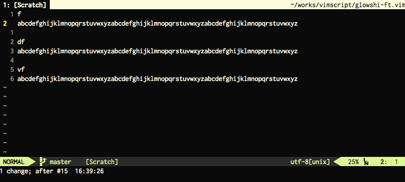

#glowshi-ft.vim

improve movement of f/t with glow shift.

##Introduction

glowshi-ft is a Vim plugin to improve movement of f/t. The basic behavior is the same, but when there are multiple targets in the current line, you are able to choose and shift to candidates of position which glow.

##Screencapture



##Interface

###Key mappings

glowshi-ft's key mappings are defined for first action only. see [ORIGINAL KEY MAPPINGS][4] about another operation.

Keymap|movement
---|---
&lt;Plug&gt;(glowshi-ft-f){char}|Search for {char} towards right from the cursor.
&lt;Plug&gt;(glowshi-ft-F){char}|Search for {char} towards left from the cursor.
&lt;Plug&gt;(glowshi-ft-t){char}|Search for till before {char} towards right from the cursor.
&lt;Plug&gt;(glowshi-ft-T){char}|Search for till after {char} towards left from the cursor.

###Original key mappings

Original mechanism judges the following key and controls it, if current line has multiple target. (the following key mappings don't use `:map` command).

Keymap|movement
---|---
h|[count] move to the left. If there is cursor in the left-side end, it move to the last.
l|[count] move to the right. If there is cursor in the right-side end, it move to the first.
^|Move to the first.
0|Same as "^".
$|Move to the last.
&lt;Enter&gt;|Fix the position under the cursor. This key is modifiable. see `g:glowshi_ft_fix_key`.|
&lt;ESC&gt;|Cancel the moving. This key is modifiable. see `g:glowshi_ft_cancel_key`.
[other keys]|In case inputting other keys, fix the position at the time, and take the state that typed the key. For example, if you press "i", you will insert mode on the position.

##Settings

###Variables

Use:
```vim
let g:option_name = option_value
```
to set them in your .vimrc.

Keymap|movement
---|---
g:glowshi_ft_no_default_key_mappings|If you don't want default key mappings, define this variable and set "1" before this plugin is loaded, and describe `:map` command for Normal mode and Operator-pending mode and Visual mode.
g:glowshi_ft_ignorecase|Ignore case in search patterns like `'ignorecase'` option. The default value is "0".
g:glowshi_ft_timeoutlen|Time in milliseconds to determine the cursor position, like `'timeoutlen'` option. The default value is "0" (no limit).
g:glowshi_ft_fix_key|When the same key as the value that you set for this variable is pressed, fix the position under the cursor. Regular expression is used in the same judgment of the key. This variable can not appoint modifier key alone. The default value is "[\\&lt;NL&gt;\\&lt;CR&gt;]" (enter key).
g:glowshi_ft_cancel_key|You can specify the key in the regular expression like `g:glowshi_ft_fix_key` option in this variable, but the behavior of matching is the cancellation of moving. The default value is "\\&lt;ESC&gt;".
g:glowshi_ft_selected_hl_ctermfg|Specify terminal vim color for selected position. The default value is "Black".
g:glowshi_ft_selected_hl_ctermbg|Specify terminal vim background color for selected position. The default value is "White".
g:glowshi_ft_selected_hl_guifg|Specify gui vim color for selected position. The default value is "#000000".
g:glowshi_ft_selected_hl_guibg|Specify gui vim background color for selected position. The default value is "#FFFFFF".
g:glowshi_ft_candidates_hl_ctermfg|Specify terminal vim color for candidates of position. The default value is "Black".
g:glowshi_ft_candidates_hl_ctermbg|Specify terminal vim background color for candidates of position. The default value is "Red".
g:glowshi_ft_candidates_hl_guifg|Specify gui vim color for candidates of position. The default value is "#000000".
g:glowshi_ft_candidates_hl_guibg|Specify gui vim background color for candidates of position. The default value is "#FF0000".

## Installation

You can install the plugin just copy "plugin" and "autoload" directories under your ~/.vim.

or

* [Pathogen][1]
 * `git clone https://github.com/saihoooooooo/glowshi-ft.vim ~/.vim/bundle/glowshi-ft.vim`
* [Vundle][2]
 * `Bundle 'saihoooooooo/glowshi-ft.vim'`
* [NeoBundle][3]
 * `NeoBundle 'saihoooooooo/glowshi-ft.vim'`

[1]: https://github.com/tpope/vim-pathogen
[2]: https://github.com/gmarik/vundle
[3]: https://github.com/Shougo/neobundle.vim
[4]: #original-key-mappings
